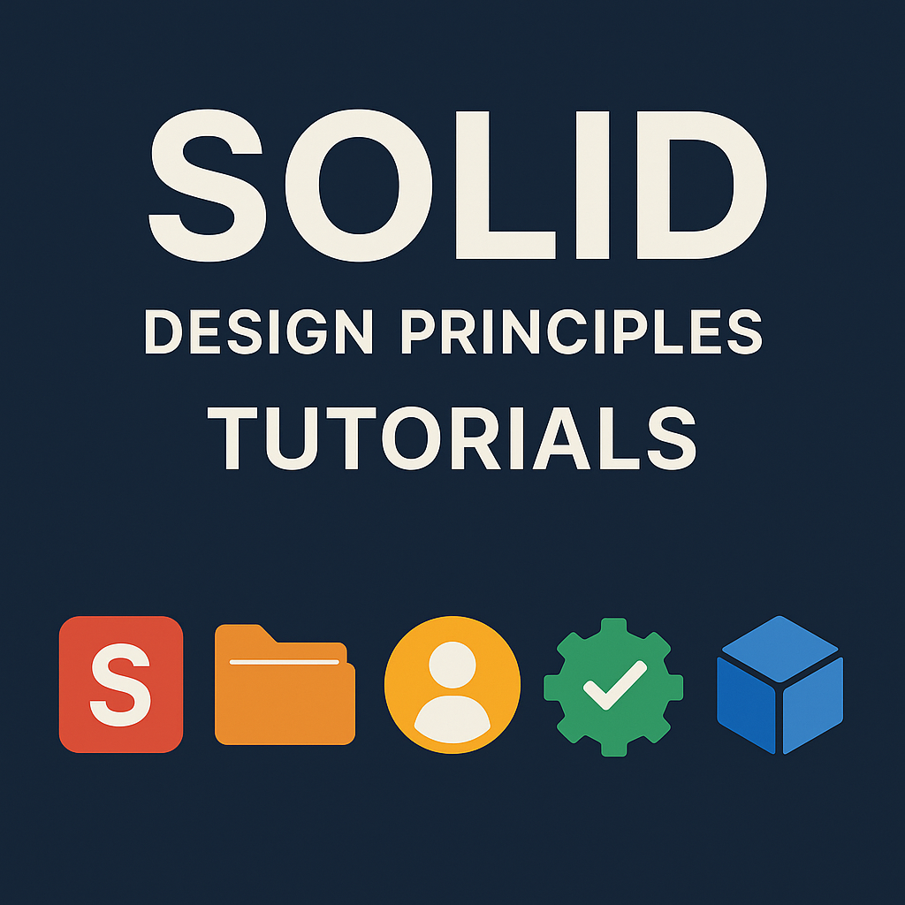

# SOLID Design Principles

<div align="center">
  
</div>

A comprehensive collection of Jupyter notebooks that teach the SOLID design principles in Python through practical examples and hands-on exercises.

## Overview

This repository contains educational materials for learning the five fundamental SOLID design principles:

- **Single Responsibility Principle (SRP)**
- **Open/Closed Principle (OCP)** 
- **Liskov Substitution Principle (LSP)**
- **Interface Segregation Principle (ISP)**
- **Dependency Inversion Principle (DIP)**

Each principle is explained with clear definitions, practical examples, and code exercises that demonstrate both violations and proper implementations.

## Getting Started

### Prerequisites

- Python 3.8 or higher
- Basic understanding of object-oriented programming
- Familiarity with Python classes and inheritance

### Setup

1. **Clone the repository**
   ```bash
   git clone https://github.com/mdhabibi/solid-principles-tutorial.git
   cd solid-principles-tutorial
   ```

2. **Create virtual environment**
   ```bash
   # Using uv (recommended)
   uv venv
   source .venv/bin/activate
   uv pip install jupyter ipykernel
   
   # Or using pip
   python -m venv .venv
   source .venv/bin/activate
   pip install jupyter ipykernel
   ```

3. **Start Jupyter**
   ```bash
   jupyter notebook
   ```

## Tutorial Structure

### [00 - SOLID Principles Overview](00_SOLID_Principles_Overview.ipynb)
Introduction to all five SOLID principles with a unified example system.

### [01 - Single Responsibility Principle](01_Single_Responsibility_Principle.ipynb)
Learn how to ensure each class has only one reason to change.

### [02 - Open/Closed Principle](02_Open_Closed_Principle.ipynb)
Design classes that are open for extension but closed for modification.

### [03 - Liskov Substitution Principle](03_Liskov_Substitution_Principle.ipynb)
Understand proper inheritance and substitutability in object-oriented design.

### [04 - Interface Segregation Principle](04_Interface_Segregation_Principle.ipynb)
Create focused interfaces that don't force clients to depend on unused methods.

### [05 - Dependency Inversion Principle](05_Dependency_Inversion_Principle.ipynb)
Design systems that depend on abstractions rather than concrete implementations.

## Learning Approach

Each notebook follows a consistent structure:

1. **Theory** - Clear explanation of the principle
2. **Bad Examples** - Code that violates the principle
3. **Good Examples** - Proper implementation following the principle
4. **Exercises** - Hands-on practice with the concepts
5. **Real-world Applications** - How the principle applies in practice

## Repository Structure

```
solid-principles-tutorial/
├── README.md
├── LICENSE
├── 00_SOLID_Principles_Overview.ipynb
├── 01_Single_Responsibility_Principle.ipynb
├── 02_Open_Closed_Principle.ipynb
├── 03_Liskov_Substitution_Principle.ipynb
├── 04_Interface_Segregation_Principle.ipynb
└── 05_Dependency_Inversion_Principle.ipynb
```

## Benefits of SOLID Principles

Understanding and applying SOLID principles leads to:

- **Maintainable Code** - Easier to modify and extend
- **Testable Code** - Components can be tested independently  
- **Flexible Design** - Adaptable to changing requirements
- **Reduced Coupling** - Loosely connected components
- **Better Reusability** - Code can be reused across projects

## Contributing

Contributions are welcome. Please feel free to:

- Report issues or suggest improvements
- Add additional examples or exercises
- Improve documentation and explanations
- Fix any errors in the code examples

## License

This project is licensed under the MIT License - see the [LICENSE](LICENSE) file for details.

## Contact

- GitHub: [@mdhabibi](https://github.com/mdhabibi)
- Email: habibi.physics@gmail.com
